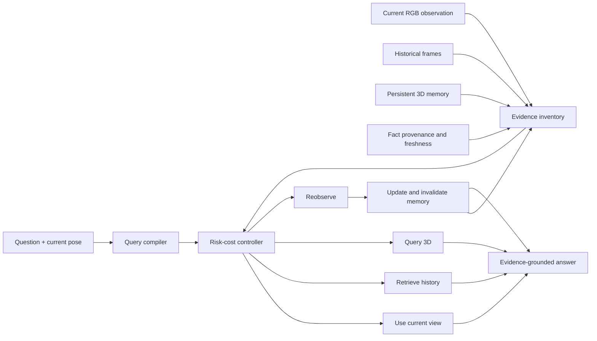

# Trust3D：创新性最强版本与最小可执行实验方案

> 工作标题：**Trust3D: Look Again or Trust Memory? Risk-Calibrated Evidence Routing over Persistent 3D Memory**  
> 定位：面向持续、第一视角、部分可观测环境的 situated Agent；不做任务专用训练（no task-specific training）。  
> 文档用途：直接交给服务器上的 Codex，按阶段实现、运行和判断是否值得继续投入。  
> 版本日期：2026-07-28。

---

## 0. 给服务器 Codex 的执行要求

请不要一次性实现完整系统。严格按本文的 Gate 0 到 Gate 7 顺序推进：

1. 当前阶段没有通过验收门槛时，不进入下一阶段。
2. 首先验证“相信记忆还是重新观察”这一核心假设；CUT3R、开放词表检测、自然语言改写和 HM3D 外测都后置。
3. 模拟器真值只能用于数据生成、Oracle 和评测，不能泄漏给被评测 Agent。
4. 所有实验保存配置、随机种子、Git commit、环境版本和逐 episode 输出。
5. 每完成一个 Gate，更新 `STATUS.md`：记录命令、结果、失败样本和继续/停止结论。
6. 不要整包安装 ALFRED 的旧版 `requirements.txt`；数据生成只安装实际需要的依赖。
7. 不要先下载 HM3D、OpenEQA-ScanNet 或 ALFRED Full。它们都不是核心可行性验证所必需的。

论文是否值得继续，首先由两个结果决定：

- 相比 `Always-Trust`，能否显著减少 stale-memory error；
- 相比 `Always-Reobserve`，能否在接近其准确率的同时显著减少移动和新观察。

如果不能同时做到这两点，应暂停扩大系统，不要用更多模块掩盖核心假设失败。

---

# 第一部分：目前创新性最强、最优版本的 idea

## 1. 一句话版本

> **Trust3D 让 situated Agent 不再无条件相信历史 3D 地图，也不对每个问题重新探索，而是依据问题所需事实、记忆来源、时间新鲜度、对象可变性和观测冲突，在当前视觉、历史证据、持久 3D 记忆与主动再观察之间选择满足风险约束的最低成本证据路径。**

这篇论文真正研究的不是“如何重建一个更漂亮的 3D 场景”，而是：

> **在动态、部分可观测的连续问答中，历史 3D 记忆什么时候仍然是证据，什么时候已经变成风险？**

## 2. 为什么这是当前最优主线

原始版本“CUT3R 持续建图 + 第一视角问答 + 问题分层 + 主动换视角”容易被评价为现成模块拼接。已有工作已经分别覆盖了：

- 连续多问题与持久 3D 记忆；
- 3D/3DGS 记忆与主动视角；
- query-conditioned 空间工具调用；
- situated 第一视角问答。

因此，以下内容不能单独作为顶会级核心创新：

- 使用 CUT3R 代替其他 3D backbone；
- 同一场景跨问题保存地图；
- 证据不足时移动；
- 将问题静态分成 2D/3D 两类；
- 使用冻结 VLM、检测器和几何模型组成 training-free pipeline。

仍然有研究空位、并且可被严格验证的组合是：

1. **事实级、时效感知的 3D 证据记忆**；
2. **成本敏感、风险约束的证据路由**；
3. **记忆冲突触发的主动再观察与事实失效机制**；
4. **区分真实观测、历史观测、几何计算和模型生成的证据来源**；
5. **专门测量 stale-memory error 与 unnecessary-reobserve 的动态连续 EQA Benchmark**。

## 3. 最强的问题定义

在时间 `t`，Agent 获得：

- 当前第一视角观察 `o_t`；
- 当前位姿 `p_t`；
- 问题 `q_t`；
- 持久记忆 `M_t`；
- 允许公开给 Agent 的事件风险线索 `z_t`，例如“这段时间环境可能被其他人访问”，但不告诉它具体改变了什么。

Agent 从证据路线集合中选择：

```text
USE_CURRENT_VIEW
RETRIEVE_HISTORY
QUERY_3D_MEMORY
REOBSERVE
ABSTAIN
```

目标不是最大化裸准确率，而是在回答风险不超过阈值的前提下最小化证据成本：

\[
r^*=\arg\min_{r\in\mathcal R} C(r)
\quad \text{s.t.}\quad
P(\text{answer error}\mid q_t,M_t,o_t,z_t,r)\leq \epsilon.
\]

成本可以包括：

\[
C(r)=
\lambda_m N_{move}+
\lambda_o N_{new\_obs}+
\lambda_v N_{VLM}+
\lambda_g N_{geometry}+\lambda_t T.
\]

MVP 阶段只保留两个核心动作：

```text
TRUST_MEMORY
REOBSERVE
```

只有二路决策验证成功，才展开成完整的五路路由。这样可以避免一开始把失败原因混在 VLM、3D 重建、导航和问题分类中。

## 4. 目标创新点

### 4.1 Query-conditioned fact dependency

不把问题固定标为“2D 问题”或“3D 问题”，而是先编译为所需事实：

```json
{
  "targets": ["cabinet_03"],
  "predicates": ["is_open"],
  "reference_frame": "current_egocentric",
  "precision": "categorical",
  "required_facts": ["cabinet_03.is_open"]
}
```

同一个问题在不同状态下可以走不同路线：当前可见时用当前帧；刚观测过时可相信记忆；存在变化风险或冲突时重新观察。

### 4.2 Provenance- and freshness-aware 3D evidence memory

记忆的基本单元不是一句文本摘要，而是带来源的事实：

```json
{
  "fact_id": "cabinet_03.is_open@t12",
  "subject": "cabinet_03",
  "predicate": "is_open",
  "value": true,
  "world_pose": [1.2, 0.8, -2.3],
  "source_type": "real_observation",
  "source_frame_ids": ["frame_0012"],
  "observed_at": 12,
  "last_verified_at": 12,
  "perception_confidence": 0.96,
  "geometry_confidence": 0.91,
  "volatility": "articulated_state",
  "invalidated": false
}
```

必须区分：

- 墙、地板、门框：长期结构事实；
- 门的位置和铰链：较稳定几何事实；
- 门的开关状态：高可变状态事实；
- 杯子、椅子等可移动物体：半静态事实；
- CUT3R/3DGS 虚拟视角生成内容：只能作为搜索先验，不能等同于真实观测证据。

### 4.3 Risk-calibrated evidence controller

事实可靠度的第一版使用确定性、可解释计算，不训练新的路由网络：

\[
\rho(f,t)=
c_{obs}\,c_{geo}\,c_{id}\,
\exp(-\Delta t/\tau_{v(f)})\,
c_{consistency}\,c_{event}.
\]

其中：

- `c_obs`：真实观测/历史观测/几何推断/生成视角的来源权重；
- `c_geo`：几何和位姿置信度；
- `c_id`：对象身份关联置信度；
- `tau_v`：不同可变性类别的时间尺度；
- `c_consistency`：当前观察与历史是否一致；
- `c_event`：公开的变化机会是否覆盖该对象或房间。

若回答依赖的任一关键事实可靠度低于阈值，Controller 选择重新观察或弃答。

### 4.4 Conflict-triggered invalidation

当前观测与历史事实冲突时，不允许把两者都保留为“可能正确”。系统应：

1. 暂停使用冲突事实回答；
2. 找到最低成本的验证视角；
3. 获取真实新观测；
4. 将旧事实标记为失效而不是物理删除；
5. 保存更新链，支持答案追溯。

### 4.5 TrustEQA-Dynamic Benchmark

Benchmark 专门区分：

- 记忆新鲜且可直接复用；
- 存在变化机会但目标实际未变；
- 存在相同变化机会且目标实际改变；
- 当前局部观察与历史冲突；
- 历史从未覆盖目标，必须探索。

它同时评估“错误地相信旧记忆”和“没有必要却重新观察”，而不是只看最终回答准确率。

## 5. 论文完整架构与 MVP 架构的关系



完整论文可以包含上图所有路线，但最小可行性实验先固定：

- 问题解析：使用 Benchmark 的符号程序，不调用 MLLM；
- 对象身份：使用模拟器 instance ID；
- 属性感知：使用 visibility-gated perception oracle；只有目标确实出现在当前传感器视野且达到像素阈值后，它才返回对象状态；
- 回答器：确定性读取选中证据，不调用生成模型；
- 再观察规划：使用 AI2-THOR 可达点和最短可见路径；
- 路由：只选 `TRUST_MEMORY` 或 `REOBSERVE`；
- 几何：先用 simulator GT pose/depth，再替换为 CUT3R。

这样测到的差异可以明确归因于记忆信任决策，而不是语言模型波动。

## 6. 需要验证的假设

### H1：动态风险确实使无条件持久记忆产生系统性错误

在目标发生未直接观测的变化后，`Always-Trust` 的 stale-memory error 应显著上升。

### H2：风险感知路由优于两个极端策略

完整方法应：

- 比 `Always-Trust` 更少陈旧记忆错误；
- 比 `Always-Reobserve` 更少移动和观察；
- 准确率接近 `Always-Reobserve`。

### H3：事实级时效优于全局地图 TTL

对墙体、门框、门状态和可移动物体采用不同可靠度衰减，应优于“一段时间后整张地图全部失效”。

### H4：3D 记忆的价值主要出现在不可见和第一视角空间问题

在目标当前不可见、但历史几何仍有效的问题上，3D 记忆应比当前帧或纯文本历史减少重新探索。

### H5：方法不应依赖某个特定 3D backbone

在 GT RGB-D/pose、简单 TSDF/对象地图和 CUT3R 之间更换几何来源时，路由原则仍成立；CUT3R 只影响性能上限，不决定论文问题是否成立。

---

# 第二部分：对原详细流程的优化与精简

## 7. 已做的关键修改

| 原流程中的负担或风险 | 修改后的方案 | 原因 |
|---|---|---|
| 一开始同时实现 VLM、CUT3R、持续建图、导航和动态数据 | 先做符号二路路由，再逐层替换 | 能定位核心假设是否成立 |
| 先处理 500 条轨迹、2,000–4,000 个问题 | 20 条 replay pilot；通过后只生成 100 个 source events | 更快暴露模拟器和数据错误 |
| 第一阶段就下载 HM3D/OpenEQA/ScanNet | 只下载 ALFRED Lite；HM3D 外测后置 | 降低存储和环境配置成本 |
| changed/unchanged 变化完全隐藏，却要求 Agent 判断哪条改变 | 加入不泄露答案的 `intervention_window` 风险线索，并区分 belief oracle 与 clairvoyant oracle | 否则两分支输入完全相同，任务不可识别 |
| 直接使用自然语言问答和 LLM 评测 | MVP 使用符号问题和确定性答案 | 避免语言波动掩盖路由效果 |
| 主动视角规划也作为新模块实现 | MVP 使用标准最短可见路径 Oracle planner | 本文研究“何时看”，不是“怎么导航” |
| 直接把 CUT3R latent state 当可编辑世界模型 | 额外维护事实表、来源、时间和失效链 | CUT3R 状态不等于可追溯语义记忆 |
| 把虚拟视角当成可回答证据 | 只允许它作为候选视角搜索先验 | 生成内容不是传感器事实 |
| 大量 baseline 和 ablation 一次跑完 | 每个 Gate 只保留能证伪当前假设的最小集合 | 降低实验成本 |

## 8. 最小范围与明确不做的内容

第一轮可行性验证只做：

- AI2-THOR 室内场景；
- ALFRED Lite 轨迹 JSON；
- `OpenObject/CloseObject` 为主；
- 100 个 source events；
- 每个 event 三种风险分支；
- `TRUST_MEMORY/REOBSERVE` 二路决策；
- 精确答案、路径成本和 stale-memory 指标。

第一轮不做：

- 真实机器人采集；
- 论文规模的自然语言改写；
- Heat/Cool/Clean 等视觉不可验证状态；
- 完整开放词表对象检测；
- 自研导航策略；
- 端到端路由训练；
- HM3D/ScanNet 全量运行；
- 8k ALFRED 轨迹全转换；
- 将 CUT3R 生成的未观测内容作为事实。

---

# 第三部分：数据和 Benchmark 设计

## 9. 公开数据来源与固定版本

### 9.1 MVP 必需

1. [ALFRED](https://github.com/askforalfred/alfred)
   - 固定 commit：`f91f4c0c96c7a29f33d0557f86b0a21035379b3b`；
   - 只下载 `json_2.1.0` Lite 数据；
   - 提供场景、初始对象位姿、开关状态、高低层动作和自然语言描述；
   - 官方轨迹对应 `ai2thor==2.1.0`。

2. [AI2-THOR](https://ai2thor.allenai.org/)
   - MVP 固定 `ai2thor==2.1.0`，优先保证 ALFRED 轨迹可复现；
   - 提供 RGB、depth、instance segmentation、对象 metadata、Agent pose 和 reachable positions。

### 9.2 核心通过后再使用

3. [Sequential-EQA](https://github.com/jangablox/sequential-eqa)
   - 固定 commit：`9e5e38209866c2184e0d254637ca02ffe8f5d84a`；
   - 50 个 HM3D 场景、498 个连续问题；
   - 用作静态连续 EQA 外部测试，不承担动态记忆主实验。

4. [OpenEQA](https://github.com/facebookresearch/open-eqa)
   - 固定 commit：`cfa3fce4595c1622bb2f8a38ae2ca9aae9eb685b`；
   - 1,600+ 人类问题；
   - 后期用作自然语言和被动历史检索测试。

5. CUT3R
   - 只在 Gate 6 后接入；
   - 固定其官方仓库 commit、checkpoint hash 和输入帧采样设置；
   - 不把更换 3D backbone 本身写成主要创新。

## 10. 动态 episode 的三种 MVP 条件

对于一个历史已观察的目标事实，例如 `cabinet_03.is_open = false`，构造：

### A. Fresh-Stable

- 不开放外部干预窗口；
- 目标状态不变；
- Agent 可以安全复用记忆；
- 最优动作是 `TRUST_MEMORY`。

### B. Risk-Stable

- 公开线索：`intervention_window = true`；
- 目标状态实际不变；
- Agent 不知道目标是否改变；
- 该分支用于测量风险策略是否过度观察。

### C. Risk-Stale

- 与 B 完全相同的公开线索；
- 执行合法的目标状态改变；
- 历史记忆过期；
- 若直接相信旧事实，会产生 stale-memory error。

B 和 C 的公开输入应尽量相同：

- 相同历史帧；
- 相同问题；
- 相同 query pose；
- 相同时间间隔；
- 相同 `intervention_window`；
- 不公开具体改变了哪个对象。

它们在单个样本上不可完全区分，这是刻意设计的风险决策，而不是分类错误。Agent 应根据允许信息估计改变概率并结合再观察成本做决策。

核心通过后再增加：

### D. Visible-Conflict

当前局部图像包含与历史不一致的线索，但不足以直接回答。该条件测试冲突检测能否触发验证。

### E. Never-Seen

历史从未覆盖目标。该条件测试系统能否避免伪造记忆，并主动探索或弃答。

## 11. 两种 Oracle 必须分开

### 11.1 Clairvoyant necessity oracle

使用模拟器隐藏真值判断当前 episode 是否真的需要重新观察。它是不可达到的性能上界，只用于诊断，不应被描述为 Agent 可学习的路由标签。

### 11.2 Belief oracle

只使用 Agent 被允许看到的信息和开发集估计的变化先验：

\[
r^*_{belief}=\arg\min_r
\mathbb E[\text{answer loss}+\lambda C(r)\mid q,M,o,z].
\]

在 B/C 的公开输入相同情况下，belief oracle 应选择相同策略。这是正确行为。论文不能用 clairvoyant oracle 的逐样本 route accuracy 要求实际 Agent。

## 12. 首批事件类型

### MVP 事件白名单

```text
OpenObject
CloseObject
```

优先对象：

```text
Cabinet
Drawer
Fridge
Microwave
Safe
```

选择条件：

- 场景中目标 instance 唯一，或可由 receptacle/位置唯一消歧；
- 事件前后 metadata 状态确实改变；
- 至少存在一个 reachable pose 能看到目标；
- 开关状态从 RGB 中具有可验证差异；
- 重放时动作成功；
- query pose 在所有分支完全一致。

### Gate 3 后再增加

```text
ToggleObjectOn / ToggleObjectOff
PickupObject / PutObject
```

`Toggle` 只保留视觉上明显的类别白名单。`Pickup/Put` 需要对象身份关联、容器可见性和同类消歧，因此后置。

### 暂时排除

```text
HeatObject
CoolObject
CleanObject
SliceObject
```

这些状态容易依赖隐藏 metadata，或从 RGB 难以可靠验证。

## 13. 问题生成

MVP 问题必须中性，不能通过措辞泄露是否发生变化。

使用：

```text
Is the cabinet currently open?
Is the drawer currently closed?
What is the current state of the microwave door?
```

不要在主模板中使用会暗示历史状态的词，例如：

```text
still
changed
again
```

每个问题同时保存符号程序：

```json
{
  "op": "GetState",
  "subject": "Cabinet|+03.21|+00.74|-01.18",
  "attribute": "isOpen",
  "answer_type": "boolean"
}
```

答案始终由当前 simulator metadata 生成，不由 LLM 生成。

后期 paraphrase 子集可以使用冻结 LLM 改写，但必须通过符号 round-trip 检查：改写问题重新解析后，与原始程序完全一致才保留。

## 14. 数据公私隔离

不要把实际 intervention、当前真值、目标可见位置或 Oracle 路线写入 Agent 可读文件。

### `episodes_public.jsonl`

```json
{
  "episode_id": "traj123_open_cabinet_t42_risk_stale",
  "group_id": "traj123_open_cabinet_t42",
  "split": "valid_unseen",
  "scene": "FloorPlan215",
  "seed": 17,
  "history_actions": "cache/actions/traj123_prefix.json",
  "history_frames": ["cache/rgb/traj123_0001.jpg"],
  "query_pose": {"x": 1.0, "y": 0.9, "z": -2.0, "rotation_y": 90},
  "elapsed_steps": 30,
  "public_context": {"intervention_window": true, "scope": "room"},
  "question": "Is the cabinet currently open?",
  "program": {"op": "GetState", "subject": "cabinet_03", "attribute": "isOpen"}
}
```

### `oracle_private.jsonl`

```json
{
  "episode_id": "traj123_open_cabinet_t42_risk_stale",
  "branch": "risk_stale",
  "hidden_intervention": {"action": "OpenObject", "target": "cabinet_03"},
  "historical_answer": false,
  "current_answer": true,
  "memory_is_stale": true,
  "target_visible_from_query": false,
  "shortest_verification_cost": 7,
  "verification_pose": {"x": 1.5, "y": 0.9, "z": -1.2, "rotation_y": 180}
}
```

运行 Agent 的进程只能读取 public 文件；Evaluator 在独立进程中读取 private 文件。

MVP 中公开的符号程序和 instance ID 是用于隔离路由变量的 grounding oracle。完整系统评测时，Agent 只接收自然语言问题，再由冻结 MLLM 和检测/跟踪模块产生同一结构，必须单独报告从 oracle grounding 到自动 grounding 的性能下降。

模拟器 metadata 只能通过两种受控接口使用：

1. Evaluator 离线读取 private 真值；
2. visibility-gated perception oracle 在 Agent 已经移动到验证视角后，确认目标确实可见，再返回该次观测对应的属性。

Agent 在选择路线之前不能访问当前属性、隐藏 intervention 或验证 pose。这个受控感知 Oracle 只用于先隔离“是否重新观察”的因果效果，Gate 7 之后再用冻结视觉模型替换。

## 15. 划分与防泄漏

- 沿用 ALFRED 原始 `train/valid_seen/valid_unseen` 划分；
- 同一个 `group_id` 的全部分支必须留在同一 split；
- 不允许同一 source trajectory 的不同分支跨 train/test；
- 阈值和成本权重只在 `valid_seen` 选择；
- `valid_unseen` 只在配置冻结后运行；
- 统计置信区间时按 `group_id` bootstrap，而不是把同一 event 的三个分支当独立样本；
- 所有生成脚本固定 seed，并保存 `manifest.json` 和 SHA256。

---

# 第四部分：服务器目录与环境

## 16. 建议目录

```text
trust3d/
├── README.md
├── STATUS.md
├── configs/
│   ├── pilot.yaml
│   ├── mvp.yaml
│   └── costs.yaml
├── external/
│   ├── alfred/
│   ├── sequential-eqa/          # Gate 7 后才需要
│   └── cut3r/                   # Gate 6 后才需要
├── trust3d/
│   ├── data/
│   │   ├── scan_alfred.py
│   │   ├── select_events.py
│   │   ├── build_branches.py
│   │   └── validate_dataset.py
│   ├── sim/
│   │   ├── controller.py
│   │   ├── restore_scene.py
│   │   ├── replay_prefix.py
│   │   └── visibility_oracle.py
│   ├── memory/
│   │   ├── fact_store.py
│   │   └── reliability.py
│   ├── routing/
│   │   ├── baselines.py
│   │   ├── controller.py
│   │   └── belief_oracle.py
│   ├── agents/
│   │   └── run_episode.py
│   └── eval/
│       ├── metrics.py
│       ├── bootstrap.py
│       └── plots.py
├── tests/
├── data/
│   ├── raw/                     # 不提交 Git
│   ├── manifests/
│   ├── episodes/
│   └── cache/                   # 只缓存实际使用帧
└── outputs/
```

## 17. 获取最小数据

```bash
mkdir -p trust3d/external
cd trust3d/external

git clone https://github.com/askforalfred/alfred.git
cd alfred
git checkout f91f4c0c96c7a29f33d0557f86b0a21035379b3b

cd data
bash download_data.sh json
```

该脚本需要 `p7zip-full`。如果服务器不能使用 `sudo`，让管理员提供 `7z`，或者在有权限的机器解压后再上传 `json_2.1.0`。不要下载 `json_feat` 或 `full`。

## 18. 最小 Python 环境

ALFRED 官方 `requirements.txt` 固定了 `torch==1.1.0` 和 `torchvision==0.3.0`，对本任务没有必要且容易破坏服务器环境。创建独立 legacy simulator 环境：

```bash
conda create -n trust3d-sim python=3.7 -y
conda activate trust3d-sim

python -m pip install --upgrade "pip<24"
python -m pip install \
  ai2thor==2.1.0 \
  numpy==1.21.6 \
  pillow \
  pandas \
  pyyaml \
  scipy \
  networkx \
  tqdm \
  pytest
```

说明：

- 先保证 `ai2thor==2.1.0` 与 ALFRED 轨迹一致，不要静默升级 simulator；
- 若该版本在服务器系统上无法启动，优先使用 ALFRED 官方兼容 Docker/旧版 Ubuntu 环境；
- 只有证明新版本重放状态等价后，才允许迁移到新版 AI2-THOR；
- CUT3R 使用单独 Conda 环境，避免 CUDA/PyTorch 依赖冲突。

Headless 服务器通常还需要可用的 OpenGL/X server。常见启动方式：

```bash
xvfb-run -a python -m trust3d.sim.controller --smoke-test
```

Gate 0 的目标只是成功启动一个 FloorPlan、执行一个动作并读取 metadata，不要先跑完整轨迹。

---

# 第五部分：逐阶段最小可执行实验

## Gate 0：仓库与 simulator smoke test

### 实现

建立项目骨架和 `trust3d/sim/controller.py`，完成：

1. 启动指定 FloorPlan；
2. 固定随机种子；
3. 获取一帧 RGB、depth、instance segmentation；
4. 输出 Agent pose 和 objects metadata；
5. 执行一个合法动作；
6. 正常关闭 Controller。

### 运行

```bash
conda activate trust3d-sim
xvfb-run -a python -m trust3d.sim.controller \
  --smoke-test \
  --scene FloorPlan1 \
  --output outputs/gate0
```

### 必须保存

```text
outputs/gate0/rgb.png
outputs/gate0/depth.npy
outputs/gate0/metadata.json
outputs/gate0/env.json
```

### 通过标准

- 进程退出码为 0；
- RGB 非全黑；
- depth 中存在有限值；
- metadata 中存在 Agent pose 和 object list；
- 同配置运行两次得到相同初始对象状态。

不通过时停止，不继续写 Benchmark 生成器。

## Gate 1：只解析 JSON，统计候选事件

这一阶段不启动 AI2-THOR。

### 实现 `scan_alfred.py`

扫描所有 trajectory JSON，输出：

- split、scene、trajectory ID；
- `Open/Close/Toggle/Pickup/Put` 次数；
- action index、target object ID/type；
- 前缀长度；
- 初始状态；
- 同类对象数量；
- 是否满足 MVP 白名单。

### 运行

```bash
python -m trust3d.data.scan_alfred \
  --alfred-json external/alfred/data/json_2.1.0 \
  --events OpenObject CloseObject \
  --output outputs/gate1/candidates.jsonl \
  --stats outputs/gate1/stats.json
```

### 单元测试

```bash
pytest -q tests/test_scan_alfred.py
```

至少手工读取 10 条输出，确认 action index、target object 和原 JSON 一致。这是代码核对，不是人工数据标注。

### 通过标准

- 总候选事件不少于 100；
- `valid_unseen` 候选不少于 20；
- 解析错误率低于 1%；
- 所有候选都能回溯到 source JSON 和 action index。

若数量不足，再按顺序放宽：

1. 加入视觉明显的 `Toggle` 白名单；
2. 加入可唯一定位的 `Pickup/Put`；
3. 不要先扩大到 Heat/Cool/Clean。

## Gate 2：20 个事件的可复现重放

### 样本

- 从不同 scene 选择 20 个候选；
- 至少一半来自 `valid_unseen`；
- 优先覆盖 Cabinet/Drawer/Fridge/Microwave。

### 实现

1. `restore_scene.py`：按 ALFRED JSON 恢复 scene、object poses 和 toggles；
2. `replay_prefix.py`：重放到目标事件前一动作；
3. `build_branches.py`：生成 Fresh-Stable、Risk-Stable、Risk-Stale；
4. `visibility_oracle.py`：枚举 reachable positions，找到最低成本的可见验证 pose；
5. `state_hash.py`：对关键对象状态和 pose 生成稳定 hash。

每个分支都从头 reset 和重放，不依赖 Unity 内部快照：

```text
Reset same FloorPlan
Restore same object poses/toggles
Replay same prefix
Apply or skip hidden intervention
Teleport to same query pose
Record public observation and private oracle
```

### 运行

```bash
xvfb-run -a python -m trust3d.data.build_branches \
  --candidates outputs/gate1/candidates.jsonl \
  --limit 20 \
  --branches fresh_stable risk_stable risk_stale \
  --seed 17 \
  --output data/episodes/pilot

python -m trust3d.data.validate_dataset \
  --public data/episodes/pilot/episodes_public.jsonl \
  --private data/episodes/pilot/oracle_private.jsonl \
  --replay-twice \
  --report outputs/gate2/validation.json
```

### 通过标准

- 至少 19/20 个 source events 可以稳定生成三个分支；
- 两次重放的关键状态 hash 一致率不低于 95%；
- 所有分支 query pose 完全一致；
- Risk-Stale 的历史答案与当前答案必须不同；
- Fresh/Risk-Stable 的历史答案与当前答案必须相同；
- 符号答案与 metadata 一致率 100%；
- 至少 90% episode 存在可达验证视角；
- public 文件中不存在 hidden intervention、current answer 或 oracle pose。

任何真值不一致都必须修复，不能通过丢弃失败分支掩盖。

## Gate 3：构建 100-event TrustEQA-Dynamic-MVP

### 数据规模

```text
100 source events
x 3 branches
x 2 neutral question templates
= approximately 600 QA episodes
```

所有分支按 `group_id` 绑定。缓存策略：

- JSON 保存场景、动作和 pose；
- 只缓存历史关键帧、query frame 和实际再观察帧；
- 不保存整条轨迹视频；
- 保存 RGB、depth、instance mask、pose，但 Agent 配置决定能看哪些模态。

### 运行

```bash
xvfb-run -a python -m trust3d.data.build_branches \
  --candidates outputs/gate1/candidates.jsonl \
  --num-source-events 100 \
  --branches fresh_stable risk_stable risk_stale \
  --questions-per-branch 2 \
  --seed 20260728 \
  --output data/episodes/mvp

python -m trust3d.data.validate_dataset \
  --public data/episodes/mvp/episodes_public.jsonl \
  --private data/episodes/mvp/oracle_private.jsonl \
  --report outputs/gate3/validation.json
```

### 必做数据检查

- 每个 branch 和对象类别的数量；
- 重放成功率；
- 目标可见像素面积分布；
- 最短验证路径长度分布；
- 历史到 query 的时间间隔分布；
- scene/split/group 重复检查；
- public/private 字段泄漏检查；
- 模板答案类别平衡。

### 通过标准

- 至少保留 90 个有效 source events；
- 分支比例为 1:1:1；
- open/closed 答案比例任一方不低于 30%；
- split 和 group 无泄漏；
- public/private 一一对应；
- 数据验证测试全部通过。

## Gate 4：离线二路路由，验证核心科学假设

这一阶段不运行自然语言 VLM，也不让导航器成为变量。

### 4.1 最小 baselines

1. `Always-Trust`：永远使用历史事实；
2. `Always-Reobserve`：每题都走最低成本验证视角；
3. `Global-TTL`：整张地图共用一个过期阈值；
4. `Fact-Freshness`：按事实类型、时间和公开风险线索决定；
5. `Trust3D-Controller`：事实可靠度 + 预期错误风险 + 再观察成本；
6. `Clairvoyant-Oracle`：使用隐藏真值的诊断上界。

MVP 中 `Fact-Freshness` 和 `Trust3D-Controller` 可以都是确定性规则；后者必须显式考虑再观察成本，而不只比较 TTL。

### 4.2 固定的路由输入

Agent 允许读取：

- 历史事实、时间戳和来源；
- 问题符号程序；
- 当前 query pose；
- `intervention_window`；
- 预先计算但不含答案的路径成本；
- 当前公开图像。

不允许读取：

- branch 名称；
- hidden intervention；
- 当前答案；
- `memory_is_stale`；
- clairvoyant necessity label。

### 4.3 运行

```bash
python -m trust3d.agents.run_episode \
  --episodes data/episodes/mvp/episodes_public.jsonl \
  --methods always_trust always_reobserve global_ttl fact_freshness trust3d \
  --config configs/mvp.yaml \
  --output outputs/gate4/routes.jsonl

python -m trust3d.eval.evaluate_routes \
  --routes outputs/gate4/routes.jsonl \
  --oracle data/episodes/mvp/oracle_private.jsonl \
  --include-clairvoyant \
  --output outputs/gate4/predictions.jsonl

python -m trust3d.eval.metrics \
  --predictions outputs/gate4/predictions.jsonl \
  --oracle data/episodes/mvp/oracle_private.jsonl \
  --group-key group_id \
  --bootstrap 10000 \
  --output outputs/gate4/metrics.json

python -m trust3d.eval.plots \
  --metrics outputs/gate4/metrics.json \
  --output outputs/gate4/plots
```

### 4.4 核心指标

```text
Answer Accuracy
Stale-Memory Error Rate
Unnecessary Reobserve Rate
Reobserve Recall on Risk-Stale
Move Steps
New Observation Count
Average Verification Cost
Abstention Rate
Expected Utility
```

定义：

\[
\text{SMER}=P(\hat a=a_{history}\neq a_{current}\mid memory\ is\ stale)
\]

\[
\text{URR}=P(\text{reobserve}\mid memory\ was\ sufficient)
\]

报告多个成本权重 `lambda` 下的 accuracy-cost Pareto 曲线，不能只选择一个有利权重。

### 4.5 Gate 4 通过标准

相对于两个极端 baseline，`Trust3D-Controller` 至少满足：

- 比 `Always-Trust` 的 stale-memory error 下降不低于 30 个百分点；
- 回答准确率距离 `Always-Reobserve` 不超过 5 个百分点；
- 比 `Always-Reobserve` 的新观察次数下降不低于 25%；
- 在至少 3 个预先指定的成本权重下取得更高 expected utility；
- 95% group-bootstrap 置信区间不跨越“无改进”线，或至少显示稳定趋势并在 `STATUS.md` 明确标为未确认。

如果只提高准确率但不省成本，说明退化成“总是重新观察”；如果只省成本但 stale error 不降，说明退化成“总是相信记忆”。两者都不支持论文主张。

## Gate 5：在线执行二路 Agent

Gate 4 通过后，才让 Agent 真正在 simulator 中执行选择。

### 在线流程

```text
Load public episode
Restore/replay history
Build fact memory through visibility-gated observations
Receive current observation, pose, question and public risk cue
Estimate required fact reliability
Choose TRUST_MEMORY or REOBSERVE
If REOBSERVE: follow standard shortest verification route
Acquire real RGB observation; only then call the visibility-gated perception adapter
Update/invalidate fact
Answer deterministically
Write trace
```

每条 trace 必须包含：

```json
{
  "episode_id": "...",
  "selected_route": "REOBSERVE",
  "required_facts": ["cabinet_03.is_open"],
  "fact_reliability_before": 0.41,
  "reason_codes": ["INTERVENTION_RISK", "HIGH_VOLATILITY"],
  "movement_steps": 7,
  "new_frame_ids": ["frame_0049"],
  "invalidated_fact_ids": ["cabinet_03.is_open@t12"],
  "answer": true,
  "answer_evidence": ["frame_0049"]
}
```

### 运行

```bash
xvfb-run -a python -m trust3d.agents.run_episode \
  --online \
  --episodes data/episodes/mvp/episodes_public.jsonl \
  --method trust3d \
  --planner shortest_visible_pose \
  --config configs/mvp.yaml \
  --output outputs/gate5/traces.jsonl
```

### 通过标准

- 在线答案和 Gate 4 离线模拟结果差异不超过 5 个百分点；
- 动作失败率低于 5%；
- Agent 不能访问 private 文件，增加自动泄漏测试；
- 每个答案都能追溯到历史或新观察 frame；
- 冲突后旧事实被标记 invalidated；
- 仍满足 Gate 4 的主要 accuracy-cost 趋势。

## Gate 6：证明 3D 记忆确实必要

前五个 Gate 主要验证“信任还是再观察”。本阶段加入第一视角和空间问题，避免论文退化为普通状态缓存。

### 6.1 自动生成的空间问题

先只做确定性、可从 simulator 几何获得真值的问题：

```text
Is the target to my left or right?
Is the target in front of or behind me?
Which of two remembered objects is closer to me?
Is object A nearer than object B?
```

世界坐标转当前 Agent 坐标：

\[
p_i^{ego}=R_t^\top(p_i^{world}-t_t).
\]

目标当前不可见，但历史真实观察已提供其 3D 位置。Fresh-Stable 中应直接查询 3D 记忆；Risk-Stale 中应先重新观察并更新位置。

### 6.2 三种几何设置

按顺序运行：

1. `GT-3D`：simulator pose/depth/object position；
2. `RGBD-Map`：使用观测到的 depth/pose 构建对象/TSDF 地图；
3. `CUT3R-Map`：只用 RGB 流恢复几何和相机状态。

前两种用于验证方法本身，第三种用于验证现实感和单目可行性。不要让 CUT3R 的失败否定路由问题本身。

### 6.3 3D 阶段 baselines

```text
Current-RGB only
All-history RGB
Persistent 3D without freshness
Always-Reobserve
Trust3D with GT/RGBD geometry
Oracle
```

### 6.4 通过标准

在“目标当前不可见但历史几何有效”的空间问题子集上：

- GT/RGBD Trust3D 比 Current-RGB 准确率高至少 10 个百分点；
- 比 Always-Reobserve 少至少 25% 新观察或移动；
- 第一视角方向计算的确定性工具误差率低于 2%；
- 记忆发生位置变化后，freshness-aware 方法的 stale spatial error 显著低于无 freshness 版本。

若 3D 方法没有超过历史帧检索，应检查问题是否真的需要 metric/egocentric geometry，而不是继续堆叠模型。

## Gate 7：最后接入 CUT3R

### 原则

- CUT3R 只替换几何和相机估计层；
- 事实表、可靠度、Controller、数据和评测保持不变；
- 不做任务专用微调；
- 输出中记录 CUT3R checkpoint、帧采样、分辨率、显存、延迟和失败率；
- 查询视角生成只能用于规划候选，最终答案需要真实观察或明确标为几何推断。

### 最小接入

先选 Gate 6 的 30 个 source events：

```bash
conda activate cut3r
python -m trust3d.geometry.run_cut3r \
  --episodes data/episodes/spatial30/episodes_public.jsonl \
  --checkpoint /path/to/cut3r_checkpoint \
  --output outputs/gate7/cut3r_geometry

python -m trust3d.agents.run_episode \
  --episodes data/episodes/spatial30/episodes_public.jsonl \
  --method trust3d \
  --geometry outputs/gate7/cut3r_geometry \
  --output outputs/gate7/predictions.jsonl
```

### 必须报告

- GT-3D 到 CUT3R 的 QA drop；
- camera/geometry failure rate；
- 3D 查询延迟；
- 持续多问题下每题摊销成本；
- CUT3R state 重用与每题重新运行的成本差；
- 静态结构与可移动对象的误差分别统计。

### 判断

- QA drop 不超过 10 个百分点：可以作为完整系统主结果；
- drop 为 10–20 个百分点：保留为现实设置，并把 backbone gap 作为限制；
- drop 超过 20 个百分点：主论文因果实验继续使用 RGB-D/GT geometry，CUT3R 只作失败分析；不要通过任务专用训练改变论文“no task-specific training”边界。

## Gate 8：静态外部测试，不属于 MVP 必需项

Gate 4–7 均通过后再接 Sequential-EQA：

```bash
cd external
git clone https://github.com/jangablox/sequential-eqa.git
cd sequential-eqa
git checkout 9e5e38209866c2184e0d254637ca02ffe8f5d84a
python -m pip install -r requirements.txt
```

使用其 50 个 HM3D scene sequence、498 个问题测试：

- 持久记忆在静态连续多问中的摊销收益；
- 事实级检索与全历史检索的成本差；
- 新 Controller 在没有动态变化时是否产生过多再观察。

不要把这个外测当成动态 Benchmark 的替代，也不要在核心假设尚未通过时先配置四个上游 Agent。

---

# 第六部分：评测、消融与论文结果组织

## 19. 最小 baseline 集合

论文主表至少包含：

| 方法 | 记忆 | 时效/风险 | 3D | 主动再观察 | 目的 |
|---|---:|---:|---:|---:|---|
| Current View | 否 | 否 | 否 | 否 | 当前观察下界 |
| Always-Trust | 是 | 否 | 可选 | 否 | 陈旧记忆风险 |
| Always-Reobserve | 是 | 否 | 可选 | 是 | 高成本准确率上界 |
| Global-TTL | 是 | 全局 | 可选 | 是 | 简单 freshness baseline |
| Persistent 3D, no calibration | 是 | 否 | 是 | 可选 | 证明 3D 不等于可信 |
| Trust3D | 是 | 事实级 | 是 | 是 | 完整方法 |
| Clairvoyant Oracle | 是 | 真值 | 是 | 是 | 诊断上界 |

后期再加入 Full-history VLM、ViSRA 式每题重建、3D-Mem/GSMem 类适配器。MVP 不需要先复现所有大型 baseline。

## 20. 最小消融

只做四个能对应核心机制的消融：

1. `- freshness`：去掉时间衰减；
2. `- volatility`：所有事实共用相同 TTL；
3. `- event/conflict`：忽略变化机会和当前冲突；
4. `- cost`：只追求可靠度，不考虑再观察代价。

如果完整方法没有稳定优于这些消融，不应声称各组件必要。

## 21. 统计方法

- 主结果按 `group_id` 做 paired bootstrap，10,000 次；
- 报告均值、95% CI 和绝对百分点差；
- 每个 source event 的多个 branch 不是独立样本；
- 所有阈值在 `valid_seen` 固定后只运行一次 `valid_unseen`；
- 同时报告总体结果和 `Fresh-Stable/Risk-Stable/Risk-Stale` 分层结果；
- accuracy-cost 图必须包含多个预先定义的成本权重，不只展示最有利点；
- 对拒答单独报告 coverage-risk 曲线。

## 22. 最关键的论文图表

1. **Accuracy vs. Reobservation Cost Pareto 曲线**；
2. **三种风险条件下的 stale error 与 unnecessary reobserve 柱状图**；
3. **随着问题序号增加的累计移动/几何调用成本**；
4. **事实年龄与预测错误率/可靠度校准曲线**；
5. **GT-3D、RGB-D map、CUT3R 的性能和成本差距**；
6. **一个记忆冲突—主动验证—旧事实失效—回答追溯的案例图**。

## 23. 失败判据

满足任一项时，暂停扩大实验：

- Always-Trust 在动态条件下几乎不产生 stale error，说明任务变化太弱；
- Always-Reobserve 成本极低，说明“是否重新观察”没有决策价值；
- Trust3D 不能同时改善 stale error 和 reobservation cost；
- public cue 直接泄露 branch 或答案；
- 结果主要来自问题模板或对象类别先验；
- 3D 空间子集不比历史 RGB 检索更需要几何；
- 只在 seen scenes 有效，在 valid_unseen 完全失效；
- CUT3R 的未观察区域生成被错误当成事实，导致虚假高分。

遇到失败应先修改 Benchmark 或缩小论文主张，不要直接训练一个更大的 router。

---

# 第七部分：最终扩展顺序

核心 Gate 通过后，按以下顺序扩展：

1. 从 100 扩展到 500 source events；
2. 加入可见的 Toggle 和可唯一识别的 Pickup/Put；
3. 加入 Visible-Conflict 与 Never-Seen；
4. 从符号程序换成冻结 MLLM query compiler；
5. 从 simulator instance ID 换成冻结检测/分割/跟踪模块；
6. 加入自然语言 paraphrase 与 OpenEQA 人类问题；
7. 接入 CUT3R 单目持续几何；
8. 运行 Sequential-EQA 静态外测；
9. 最后才考虑少量真实 RGB-D/机器人序列验证模拟到真实的趋势。

真实实验不需要重新构建大规模 Benchmark。20–50 条人工操作但无需人工问答标注的序列，即可作为定性和小规模定量验证。

---

# 第八部分：预期论文结论边界

## 24. 可以声称

- 在动态连续 EQA 中，无条件持久记忆会产生可测量的陈旧证据错误；
- 事实级来源、时效、可变性和冲突信号可支持更好的 accuracy-cost 决策；
- 持久 3D 记忆在当前不可见、第一视角空间问题中可以减少重复探索；
- 不进行任务专用训练也能实现有效的证据编排；
- 自动反事实数据可以低成本评估“相信还是重看”。

## 25. 不应声称

- 整个系统完全 training-free；CUT3R、VLM 和检测器都经过预训练；
- Agent 能知道完全不可观测的具体变化；它只能基于风险和证据决策；
- CUT3R 的生成视角等同于真实世界证据；
- 该方法解决了通用动态世界建模；MVP 只覆盖有限室内状态变化；
- 模拟器 metadata 是 Agent 输入；它只用于生成真值和评测；
- 简单替换 3D backbone 本身构成主要创新。

建议论文统一使用：

> **no task-specific training** 或 **training-free orchestration**

不要使用容易被审稿人攻击的“the entire system is training-free”。

---

# 第九部分：最终交付物清单

服务器 Codex 完成可行性验证后，项目至少应包含：

```text
[ ] 固定版本与数据 manifest
[ ] Gate 0 simulator smoke test
[ ] ALFRED candidate statistics
[ ] 20-event replay validation report
[ ] 100-event public/private Benchmark
[ ] 数据泄漏与重放单元测试
[ ] 六个最小 baseline
[ ] Gate 4 离线路由结果
[ ] Gate 5 在线执行 traces
[ ] Gate 6 GT/RGB-D 3D 空间结果
[ ] Gate 7 CUT3R 小规模结果
[ ] group-bootstrap 置信区间
[ ] accuracy-cost Pareto 图
[ ] stale-memory 和 unnecessary-reobserve 分层结果
[ ] STATUS.md 中明确的继续/停止结论
```

## 26. 服务器 Codex 的首条提示词

```text
请完整阅读 Trust3D_服务器最小可执行实验方案.md。
不要一次性实现完整系统，先执行 Gate 0。
每个 Gate 必须先写最小测试、运行验收命令并把结果记录到 STATUS.md；
没有通过当前 Gate 时不要进入下一阶段。
模拟器 private oracle 不得进入 Agent 输入。
先验证 TRUST_MEMORY 与 REOBSERVE 的 accuracy-cost 优势，CUT3R 和 HM3D 后置。
```

---

# 参考项目与最接近工作

- [ALFRED](https://github.com/askforalfred/alfred)
- [AI2-THOR](https://ai2thor.allenai.org/)
- [Sequential-EQA / Beyond Episodic Evaluation](https://github.com/jangablox/sequential-eqa)
- [OpenEQA](https://github.com/facebookresearch/open-eqa)
- 3D-Mem：持久、空间对齐的 3D 记忆基础工作；
- GSMem：3DGS 记忆、视角生成与 zero-shot EQA 的强相关工作；
- 3DGSNav：持久 3DGS 记忆和主动视角的 ObjectNav 相关工作；
- ViSRA：按问题调用空间工具，但不是跨问题持续世界状态；
- SpatialWorld：闭环主动探索评测，但不等于时效感知的持久 3D 证据路由。

最终论文的差异声明应始终围绕：

> **动态连续 EQA 中，对历史 3D 事实进行来源、时效和风险校准，并在回答错误风险与再观察成本之间做可追溯决策。**
